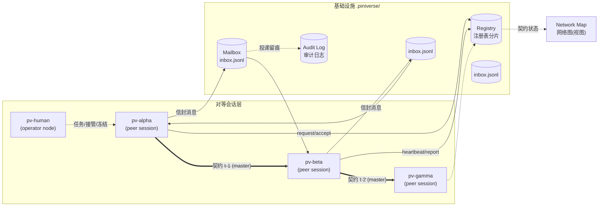

# 01 · 术语与核心概念

> 状态：草案 Draft v0.1 · 2026-08-29
> 上游：[00 愿景](00-vision.md) ｜ 下游：[02 架构](02-architecture.md) · [03 消息协议](03-message-protocol.md)

## 本章要点

- 给出 Piniverse 全部核心术语的规范定义与英文对照；后续文档一律沿用本表词汇。
- 核心概念只有七个一组：**对等会话、消息/信箱、注册表、任务契约、关系图、基础设施、策略**。
- 文末辨析与旧词汇（subagent、task、orchestrator、user）的差异。

---

## 1. 世界观一张图

要点：**实线消息**走信箱；**粗边契约**是注册表里由消息推导出的状态；**网络图**只是视图，不是组件。`pv-human` 与其他会话走同样的消息路径，只是策略角色不同。

## 2. 术语表

### 2.1 会话与身份

| 术语 | 英文 | 定义 |
|------|------|------|
| 对等会话 | Peer / Peer Session | 一个加载了 pv-ext 的完整 Pi 会话，网络的基本成员。能力、工具、system prompt 与其他对等体完全一致 |
| 身份 | PID (Piniverse ID) | 注册时分配的稳定标识，形如 `pv-3f8a12c0`。契约、信箱、注册表分片都以此为主键 |
| 名字 | Name | 人类可读的显示名（如 `pv-alpha`），在单个 `.piniverse/` 域内唯一；消息寻址允许用名字，投递前解析为 PID |
| 档案 | Profile | 会话注册时自述的一段话 + 能力标签，供他人发现时参考 |
| 能力标签 | Capability Tag | 描述会话擅长领域的短标签。标准标签集见 [05 §4](05-registry-lifecycle.md#4-发现)；允许自由扩展 |
| 信誉 | Reputation | 注册表中积累的契约结果统计（completed / failed / resigned 计数）。**只展示、不自动排序**（见 [open-questions](open-questions.md)） |
| 操作员节点 | Operator Node (`pv-human`) | 人类的对等身份。技术上是普通对等体，策略角色为 `operator`，拥有最高权力（冻结、接管、解散任何契约） |

### 2.2 消息与信箱

| 术语 | 英文 | 定义 |
|------|------|------|
| 信封 | Envelope | 消息的传输单元，字段规范见 [03 §2](03-message-protocol.md#2-信封envelope)。类型、来源、去向、关联、载荷 |
| 消息类型 | Message Type | 信封的 `type` 字段。初始分类 16 种（request/accept/decline/counter/report/result/review/steer/cancel/resign/escalate/notify/query/reply/broadcast/heartbeat），见 [03 §3](03-message-protocol.md#3-消息类型总表) |
| 信箱 | Mailbox | 每个对等体一个的追加式文件队列（`.piniverse/mailboxes/<pid>/inbox.jsonl`）。发送方直接追加写入 |
| 投递 | Delivery | 接收方 pv-ext 监视信箱文件变化，把新信封注入 Pi 上下文（push）或由 `check_inbox` 工具批量拉取（pull） |
| 注入 | Injection | 把信封渲染为 `customType: "pv-message"` 的消息，经 `pi.sendMessage` 进入 LLM 上下文。deliverAs 模式映射见 [03 §7](03-message-protocol.md#7-与-pi-注入机制的对齐) |
| 审计日志 | Audit Log | `.piniverse/audit/` 下按月分片的追加式 JSONL，记录每个信封的发送与投递事件。重放日志可完整重建所有契约状态 |
| 话题 | Topic | broadcast 消息的定址单位。订阅关系记录在注册表，见 [03 §5](03-message-protocol.md#5-寻址与名字) |

### 2.3 注册表

| 术语 | 英文 | 定义 |
|------|------|------|
| 注册表 | Registry | `.piniverse/registry/` 下的**每对等体一个分片文件** + 共享的契约存储。记录身份、档案、状态、心跳、信誉 |
| 注册 | Registration | 会话启动时（`session_start`）在注册表创建/更新自己分片的过程 |
| 心跳 | Heartbeat | 会话定期（默认 30s）续期 `alive_until` 戳；超时（默认 90s）视为离线。用 Pi 的事件驱动，不占 turn |
| 状态 | Status | `idle`（空闲可受托）/ `busy`（持有活跃契约）/ `frozen`（被操作员冻结）/ `offline`（心跳超时） |
| 分片 | Shard | 注册表的每对等体文件。分片化让注册不需要全局锁（各会话只写自己的文件） |

### 2.4 任务契约（本体系的中心概念）

| 术语 | 英文 | 定义 |
|------|------|------|
| 任务契约 | Task Contract | 委托方与受托方之间、由 `request`+`accept` 双边同意建立的控制关系实例。随任务生、随任务死。别名：control lease |
| 委托方 | Master | 契约中发出 request 并被 accept 的一方。契约期间对受托方持有**有界权利** |
| 受托方 | Worker | 契约中 accept 的一方。契约期间承担**有界义务**，保留拒绝、辞任与再委托权 |
| 规格 | Spec | 契约的任务描述：目标、交付物定义（deliverable）、验收标准（acceptance criteria）、约束 |
| 预算 | Budget | 契约允许消耗的 token/费用/时间上限。**沿委托链逐层包含**（子契约预算 ⊆ 母契约预算），见 [08 §4](08-safety-governance.md#4-预算与计量) |
| 期限 | Deadline / TTL | 契约的截止时间；超时未交付自动进入 `expired` 终态 |
| 契约 ID | Contract ID | 形如 `t-9f3e21ab`，由委托方在发 request 时生成，全网络唯一 |
| 关系图 | Relation Graph | 任意时刻全部活跃契约构成的图：顶点=对等体，有向边=契约（master→worker）。必须保持无环（硬规则），见 [06 §3](06-network-dynamics.md#3-等待与死锁) |
| 网络图 | Network Map | 关系图 + 状态的实时可视化（TUI widget / hub 页面）。**只是视图**，不参与任何决策 |
| 再委托 | Re-delegation / Subcontract | 受托方在自己契约范围内、以自己的预算为上限，继续向下建立子契约。网络生长的唯一方式 |

### 2.5 基础设施与治理

| 术语 | 英文 | 定义 |
|------|------|------|
| pv-core | — | 协议与共享库 TS 包：信封类型、校验、信箱读写、注册表客户端、契约状态机 |
| pv-ext | — | 加载进每个对等会话的 Pi 扩展：注册消息工具、投递注入、心跳、策略钩子、状态卡 |
| pv-hub | — | **可选**的旁路进程：聚合注册表与日志，提供网络图页面、预算看板、操作员控制台。对消息路径零依赖 |
| pv | — | 启动器 CLI：批量拉起对等会话（Form B，见 [11 §3](11-implementation.md#3-两种起步形态)） |
| 策略 | Policy | `.piniverse/config/policy.json`：深度上限、预算上限、广播规则、限流、按角色/契约的权限。由 pv-ext 钩子强制 |
| 熔断 | Freeze | 操作员设置全局或定点冻结：`frozen` 状态下收不到新 request、危险工具被钩子拦截、在途 turn 允许自然结束 |
| 升级 | Escalation | 会话把超出自身权限/能力/预算的决策以 `escalate` 消息上报操作员（或契约委托方）请求裁决 |

## 3. 一次委托里，概念如何登场

以最小剧情串联全部术语（时序细节见 [09 §S1](09-scenarios.md)）：

1. 操作员在自己的会话 `pv-human` 中输入任务 → 以 `request` 投入 `pv-alpha` 的**信箱**。
2. `pv-alpha` 的 pv-ext 把信封**注入**上下文；alpha 的 LLM 决定自己完成调研部分、把写报告部分**委托**出去：生成契约 ID `t-9f3e21ab`，向查得的 `pv-beta` 发 `request`（含 **spec** 与 **budget**）。
3. `pv-beta` accept → 注册表**契约存储**里出现一条 `active` 契约；**关系图**多了一条 alpha→beta 的边，**网络图**上可见。
4. beta 干活，间或发 `report`；alpha 途中需求变化，发 `steer`；beta 认为合理，调整后继续。
5. beta 发 `result`（summary + 工件指针）；alpha 检查验收标准，回 `review(accepted)` → 契约进入 `completed` 终态，关系图边消失，双方**信誉**计数更新。
6. 全程每个信封在**审计日志**留痕；任何时刻重放日志都能重建第 3 步以来的全部状态——**关系即协议**。

## 4. 与旧词汇的辨析

| 常见词 | Piniverse 中的对应与差异 |
|--------|------------------------|
| subagent（子代理） | 不存在"子代理"这种身份。只有**对等体**与**契约**。一个会话在契约 t-1 中是 worker，同时可以在自己建立的 t-2 中是 master。官方 subagent 示例那种"spawn 一个隔离子上下文的下属"在 Piniverse 中退化为一种**退化的契约用法**（一次性、不转委托），而不是独立机制 |
| task（任务） | "任务"是自然语言概念；协议中落地为**契约**。区别在于契约携带双边同意、权利义务与预算，而不只是一段 prompt |
| orchestrator（编排器） | 不存在。分发与规划是各对等体 LLM 的局部决策。pv-hub 只看不说——它聚合视图、计量预算、落审计，对消息路径没有依赖也没有权力 |
| user（用户） | 人类以**操作员节点** `pv-human` 入网。对任意会话而言，收到 `pv-human` 的 request 与收到任何对等体的 request 走完全相同的路径——区别只在策略角色：operator 的 request 可以越过部分常规限制（如深度上限的豁免），且其 escalate 请求有最短响应义务 |
| session（Pi 会话） | Piniverse 的"对等会话"就是一个 Pi 会话 + pv-ext。**身份（PID）绑定会话实例**：resume 视为新实例（默认分配新 PID），fork/clone 一定是新对等体、不继承契约——理由见 [05 §6](05-registry-lifecycle.md#6-恢复与异常) |

## 推荐 / 备选 / 开放问题

**推荐**：上表词汇即规范。核心命名取舍——用 **Task Contract（任务契约）** 而非 "lease"（租约只强调时限，契约还强调双边同意与义务）；用 **master/worker**（中文：委托方/受托方）而非 client/server（暗示网络服务）或 delegator/performer（冗长）；受托方的转委托行为统一叫 **subcontract（再委托）**。

**备选**：`requester/acceptor`（强调双边动作，但丢失"谁掌舵"的直觉）；`employer/contractor`（隐喻生动，但正式场合累赘）；`upstream/downstream`（描述数据流时有用，可在 [07](07-context-information.md) 中作为语境词使用，不作角色名）。

**开放问题**：角色命名是否需要中性化/更精确的术语、reputation 是否参与发现排序等，见 [open-questions](open-questions.md) Q1、Q9。
