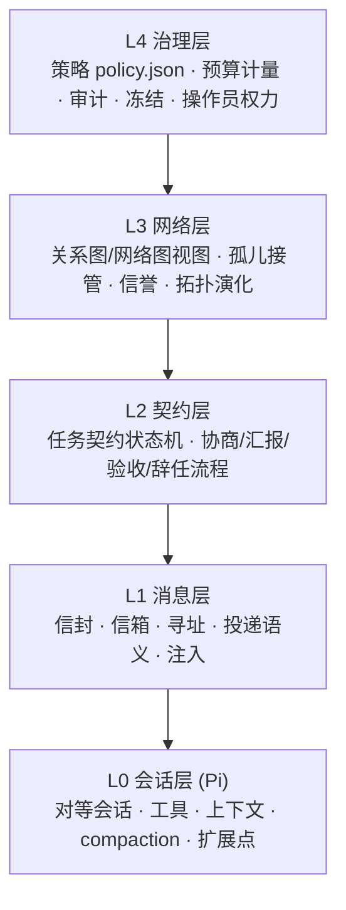
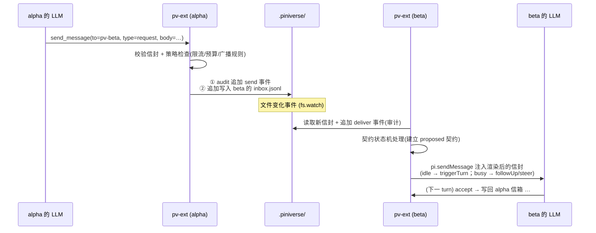

# 02 · 总体架构

> 状态：草案 Draft v0.1 · 2026-08-29
> 上游：[01 概念](01-concepts.md) ｜ 下游：[03 消息协议](03-message-protocol.md) · [11 实现路线](11-implementation.md)

## 本章要点

- 五层模型：L0 会话层（Pi）→ L1 消息层 → L2 契约层 → L3 网络层 → L4 治理层。每层只依赖下一层。
- 四个组件：`pv-core`（库）、`pv-ext`（每会话扩展，核心载体）、`pv-hub`（可选旁路观察者）、`pv`（启动器）。
- 传输决策：**文件信箱优先**——追加式 JSONL + 文件监视，天然可审计、崩溃安全；hub 永不在消息路径上。
- 划清"基础设施无决策"的边界：基础设施可以验证/投递/记录/按策略拦截，不可以选择/改写/撮合。

---

## 1. 分层模型



| 层 | 职责 | 由谁实现 | 关键文档 |
|----|------|---------|---------|
| L0 会话层 | 提供对等体本体：LLM 循环、内置工具、会话持久化、扩展 API（`registerTool` / `on(...)` / `sendMessage` / `appendEntry`） | Pi 本体 + pv-ext 的挂载 | [11 §2](11-implementation.md#2-pi-api-映射表) |
| L1 消息层 | 让"给某个对等体发一条消息"成为可靠原语：信封校验、信箱读写、投递注入、基本限流 | pv-core + pv-ext | [03](03-message-protocol.md) |
| L2 契约层 | 让"控制关系"成为可协商、可审计的对象：契约状态机、协商/汇报/验收/辞任流程 | pv-ext（状态机在 pv-core） | [04](04-control-relations.md) |
| L3 网络层 | 让"网络"成为可观察、可恢复的对象：关系图推导、孤儿检测与接管规程、信誉统计 | pv-core + pv-hub（视图） | [06](06-network-dynamics.md) |
| L4 治理层 | 让"安全"成为可配置、可强制的对象：策略文件、钩子执行、预算计量、审计、冻结 | pv-ext 钩子 + policy.json + pv-hub | [08](08-safety-governance.md) |

分层纪律：**上层只能通过下层定义的原语表达自己**。例如 L2 的"取消"必须表达为 `cancel` 消息（L1），而不是直接改注册表；L3 的孤儿接管规程由消息与既有契约语义组成，不引入新的控制通道。这条纪律保证了重放日志可完整重建 L2/L3 状态（[04 §5](04-control-relations.md#5-关系即协议状态由消息推导)）。

## 2. 组件与 Pi 的集成面

| 组件 | 形态 | 职责 | 明确不做 |
|------|------|------|---------|
| **pv-core** | TS 库（无 I/O 副作用的纯逻辑 + 文件原语） | 信封类型与校验；信箱 append/read（含文件锁封装）；注册表分片读写；契约状态机（纯函数：`f(状态, 消息) → 状态`）；关系图与环检测；预算不变量计算 | 不直接调用 Pi API；不含任何 LLM 提示词 |
| **pv-ext** | Pi 扩展（每个对等会话加载一份） | 注册消息工具（`send_message` / `check_inbox` / `list_peers` / `query_peers` 等）；监视信箱并注入投递；心跳与注册；契约簿记（`pi.appendEntry`）；策略钩子（`on("tool_call")` 等）；状态卡与 TUI widget | 不替会话做决策（发现结果只列出，选择由 LLM 做）；不与其他 pv-ext 直接通信（只经信箱） |
| **pv-hub** | 可选旁路 Node 进程 | 聚合注册表 + 审计日志 → 网络图页面、预算看板、操作员控制台（冻结/接管/发消息的界面）；注册表清扫（标记超时离线） | **不在消息路径上**——拔掉 hub，网络照常工作，只是不可视 |
| **pv** | 启动器 CLI | Form B：批量拉起 `pi --mode rpc` 会话并注入共享环境（[11 §3](11-implementation.md#3-两种起步形态)） | 拉起之后即退居二线；对子会话无任何持续权力 |

pv-ext 挂载的关键 Pi 扩展点（完整映射表见 [11 §2](11-implementation.md#2-pi-api-映射表)）：

- `pi.registerTool()` —— 全部消息/发现工具的入口；
- `pi.on("session_start" | "session_shutdown")` —— 注册与注销；
- `pi.sendMessage({customType:"pv-message", ...})` —— 收信注入（push 路径）；
- `pi.appendEntry()` —— 契约簿记与状态卡持久化（不在 LLM 上下文、可跨 compaction）；
- `pi.on("tool_call")` —— 策略强制点（深度/环/预算/限流/按契约限权）；
- `ctx.ui.setWidget()` —— 本会话视角的契约面板（网络图的局部）。

## 3. 进程与文件布局

单机假设（MVP）：N 个 Pi 会话进程 + 0~1 个 hub 进程，共享同一工作区。全部状态落在工作区的 `.piniverse/`：

```text
<workspace>/
├── .piniverse/
│   ├── registry/                      # 注册表（每对等体一个分片文件）
│   │   ├── pv-3f8a12c0.json           #   {pid,name,profile,capabilities[],
│   │   ├── pv-81b0de47.json           #    status,alive_until,reputation,...}
│   │   └── ...
│   ├── contracts/
│   │   └── active.json                # 活跃契约存储（物化视图，可由日志重建）
│   ├── mailboxes/
│   │   ├── pv-3f8a12c0/
│   │   │   └── inbox.jsonl            # 追加式信箱：一行一个信封
│   │   └── pv-81b0de47/
│   │       └── inbox.jsonl
│   ├── audit/
│   │   ├── 2026-08.jsonl              # 按月分片的审计日志（send/deliver 双事件）
│   │   └── 2026-09.jsonl
│   └── config/
│       └── policy.json                # 策略（[08](08-safety-governance.md)）
└── （任务工件散布在工作区任意位置，消息只携带指针）
```

布局决策的三个理由：

1. **一切皆文本**（P8）：注册表、契约、消息、审计全部是普通文件——可 `git diff`、可 grep、可离线分析；hub 不在也能人肉读。
2. **分片避免全局锁**：每个对等体只写自己的注册分片与自己的信箱，写写冲突面最小；`contracts/active.json` 是唯一的共享写点，用短临界区文件锁保护（[11 §4](11-implementation.md#4-pv-ext-内部结构)）。
3. **崩溃安全**：追加式写入 + 逐行 JSONL，进程在任何时刻死亡都不会损坏已提交的消息；未投递的信封留在信箱里，重启后继续投递。

## 4. 消息端到端路径

以 `pv-alpha` 给 `pv-beta` 发一条 `request` 为例，标注每一步的执行者：



push 与 pull 并存：默认 push（注入），LLM 也可以随时用 `check_inbox` 批量拉取（例如刚被 compaction 之后想快速恢复全貌）。投递语义与注入模式映射的规范在 [03 §6–7](03-message-protocol.md#6-投递语义)。

## 5. 传输决策：为什么文件信箱优先

**推荐**：追加式文件信箱（上图）。理由：

- **可审计是免费赠品**：信箱 + 双事件日志天然构成完整证据链，无需额外落盘逻辑（P8 直接成立）；
- **崩溃安全**：append-only 对进程死亡和断电都最友好；
- **零额外进程**：Form A（人工开 N 个终端）即可组网，与"对等"哲学一致——网络不依赖任何在场的权威进程；
- **Pi 生态契合**：Pi 本身就是文件中心的设计（会话是 JSONL、项目上下文是 AGENTS.md）；`fs.watch` + 防抖在 Windows/macOS/Linux 上都可用。

**备选 1：broker 进程**（hub 兼职路由）。优点：投递原子性与顺序由单进程保证、可以做推送式唤醒。缺点：消息路径上出现常驻权威进程，违背"网络不依赖在场权威"；崩溃即全断；审计要额外设计。→ 折衷：hub 永远只做旁路观察者；若未来确需 broker，须证明其可随时重启且重启期间消息零丢失（见 [open-questions](open-questions.md) Q11）。

**备选 2：本机 socket/IPC（WebSocket 或 Unix domain socket）**。优点：低延迟、天然事件推送。缺点：失去"文本可查"性质（除非双写日志）、连接生命周期管理复杂。→ 仅在跨机演进时重新评估（Q6）。

**演进路径**：M1–M3 全部使用文件信箱；M4 若出现真实的性能或原子性痛点，允许在**不改信封格式与审计格式**的前提下把信箱读替换为 hub 提供的本地推送服务——信箱文件退化为兼容回退。

## 6. "基础设施无决策"的边界

这是 P6 的操作化定义，也是审查任何新功能的试金石：

| 基础设施**可以做** | 基础设施**不可以做** |
|---|---|
| 校验信封格式与签名级完整性 | 修改信封 body 的语义内容 |
| 按策略**拦截**违规消息（限流、超预算、成环、被冻结）——拒绝是策略的机械执行，不是决策 | 按"谁更合适"**排序或撮合** request 的目标（发现工具只返回列表，选择属于发起方 LLM） |
| 投递、重试、超时判定、离线标记 | 主动替会话发任何消息（包括"贴心"的提醒广播） |
| 记录、聚合、可视化、按日志重放状态 | 在契约状态机上做任何日志之外的状态跃迁 |
| 冻结执行（策略被 operator 设置后机械执行） | 设置策略本身（策略只能由 operator 人类修改） |

**归属一览**：任务拆分与目标选择 → 各会话 LLM；受托/拒绝/还价 → 受托方 LLM；流程与安全规则 → 协议 + policy.json（人类制定，钩子执行）；全局干预 → operator。没有任何环节归属"平台智能"。

## 推荐 / 备选 / 开放问题

**推荐**：五层模型 + 四组件；文件信箱传输；`.piniverse/` 单一根目录（一个工作区一个网络域）；hub 永远旁路。

**备选**：中心 broker（见 §5）；注册表用 SQLite 替代 JSON 分片（并发更强，但牺牲"文本可读 + git 友好"，M4 前不考虑）；pv-ext 拆分为"通信扩展 + 治理扩展"两个加载单元（隔离关注点，但增加配置面，暂不拆）。

**开放问题**：hub 何时必须存在（Q11）；跨进程文件锁在 Windows 上的细节策略（Q13 关联，实现期决定）；`contracts/active.json` 单写点是否会成为 M3 的瓶颈（若会，退化为每契约一个文件）。
