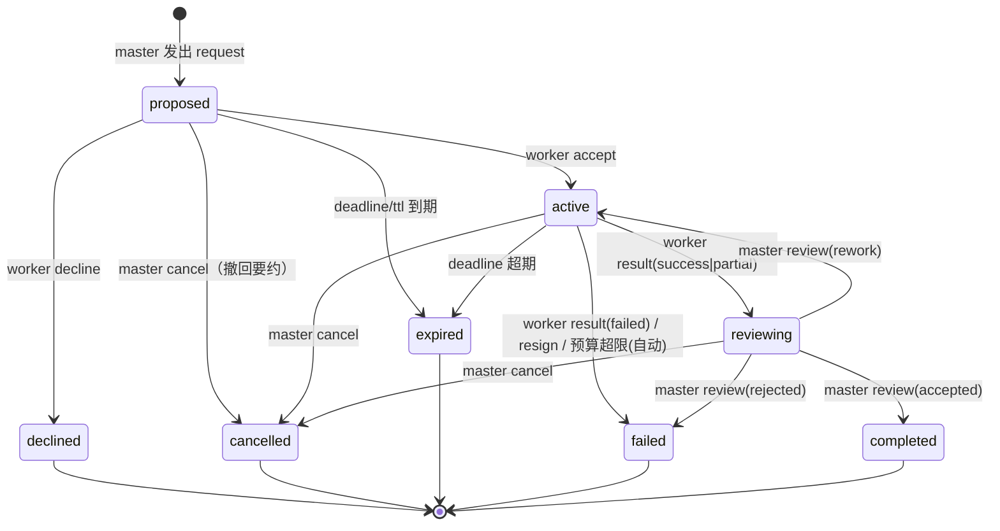

# 04 · 控制关系与任务契约

> 状态：草案 Draft v0.1 · 2026-08-29
> 上游：[03 消息协议](03-message-protocol.md) ｜ 下游：[06 网络动力学](06-network-dynamics.md) · [09 场景走查](09-scenarios.md)

本文件定义 Piniverse 的中心机制：**任务契约（Task Contract）**——对等会话之间动态主从关系的完整形态。

## 本章要点

- 契约是**关系的实例**，不是代理的身份：一个会话在 t-1 里是 worker，同时在 t-2 里是 master，两者互不干扰。
- 契约状态机 8 个状态、5 个终态；每一次跃迁都必须由一条已审计的消息驱动（**关系即协议**）。
- "相互控制"有四个来源：双边同意、双向解除、权利有界、双向验收——外加非正式的信誉展示。
- 受托方的**再委托权**是网络生长的唯一方式；活跃契约图必须无环（accept 时硬校验）。

---

## 1. 立论：契约不是身份

| 维度 | 机构式 subagent | Piniverse 契约 |
|------|----------------|----------------|
| 权力来源 | 创建行为本身（spawn 即统治） | 对方 accept（要约–承诺） |
| 角色可变性 | 固定（子代理永远是子代理） | 每份契约独立；同一会话可同时是多个契约的 master 和 worker |
| 控制方向 | 单向（父→子） | 相互（见 §4） |
| 关系存续 | 与子代理进程同寿命，通常一次 | 显式状态机管理，随任务生灭；同一对会话可先后/并行持有多份契约 |
| 深度 | 制度上限（常为 1） | 无制度上限；策略护栏（[06 §4](06-network-dynamics.md#4-失控防护四件套)） |
| 失败语义 | 异常向上抛 | 契约进入终态，由 master 决定接管/重委托/放弃 |

**判定试金石**：任何时刻问"X 对 Y 有什么权力？"——答案永远不是"X 是 Y 的上级"，而是"X 在契约 t-3 中是 Y 的 master，因此拥有该契约下的 steer/cancel/验收权"。

## 2. 契约记录

契约在注册表契约存储（`contracts/active.json`，物化视图）中的完整记录：

```json
{
  "contract_id": "t-9f3e21ab",
  "master": "pv-3f8a12c0",
  "worker": "pv-81b0de47",
  "state": "active",
  "depth": 2,
  "spec": { "goal": "…", "deliverable": "…", "acceptance": ["…"], "constraints": ["…"], "context": ["…"] },
  "budget": { "tokens": 120000, "cost": 0.8 },
  "deadline": "2026-08-29T18:00:00+08:00",
  "priority": "high",
  "sandbox": false,
  "spend": { "tokens": 41000, "cost": 0.27 },
  "created_at": "2026-08-29T14:03:02+08:00",
  "history": ["0c9d6a52-…", "b41e7f09-…"]
}
```

- **`depth`（链深）**：由 pv-core 在 request 发出时计算——发送方当前最深**入向**活跃契约的 depth + 1（操作员或无契约会话发起则为 1）。它是失控护栏（深度上限）的计量基础，不是身份属性。
- **`history`**：驱动本契约每次状态跃迁的 msg_id 序列。它是状态的**唯一凭证**。
- **`spend`**：worker 汇报的累计消耗（report/result 携带），master 侧视图与 hub 看板直接读取。

## 3. 状态机



跃迁表（谁、以什么消息、触发什么）：

| # | 从 → 到 | 触发消息 | 发送方 | 说明 |
|---|--------|---------|--------|------|
| 1 | ∅ → proposed | `request` | 候选 master | 要约建立；`task_id` 由此消息携带 |
| 2 | proposed → active | `accept` | worker | 可附 plan/eta；同时触发环检测（§5） |
| 3 | proposed → declined | `decline` | worker | 必带 reason；终态 |
| 4 | proposed → cancelled | `cancel` | master | 撤回要约，无信誉影响 |
| 5 | proposed → expired | 定时 | （pv-ext 检查） | 要约过期；机械执行 |
| 6 | active → reviewing | `result(success\|partial)` | worker | 交付待验；partial 必带 handoff_notes |
| 7 | active → failed | `result(failed)` / `resign` / 预算超限 | worker / （策略自动） | resign 必带 progress+handoff_notes |
| 8 | active → cancelled | `cancel` | master | 解约；worker 应尽快停止（尽力而为） |
| 9 | active → expired | 定时 | （pv-ext 检查） | deadline 超期未交付 |
| 10 | reviewing → completed | `review(accepted)` | master | 唯一"成功"终态；双方信誉 +1 |
| 11 | reviewing → active | `review(rework)` | master | 附具体意见，返工 |
| 12 | reviewing → failed | `review(rejected)` | master | 验收不通过且不返工 |
| 13 | reviewing → cancelled | `cancel` | master | 交付前撤资 |

**幂等与非法跃迁**：重复收到同一 `accept`（crash 重放）→ 忽略但重发当前状态确认；任何不在表中的消息/跃迁组合（如 worker 发 `cancel`）→ 拒绝并记审计 `reject`。状态机的实现是 pv-core 中的纯函数 `transition(state, envelope) → {state', events[]}`，非法即抛错——**LLM 没有任何通道能直接改契约状态**。

## 4. 权利义务

### 4.1 master 的权利与义务

| 权利 | 边界 |
|------|------|
| steer（转向） | **仅限契约范围**；`steer` 可打断在途 turn（[03 §7](03-message-protocol.md#7-与-pi-注入机制的对齐)）；worker 判定越界时可拒绝并 escalate |
| cancel（取消） | 任意时刻；已消耗预算照付（记入 spend，不退还） |
| 催报 | `query(task_id=…)`；响应节奏受 worker 义务约束 |
| 验收 | verdict 只能依据 **spec.acceptance** 判断；超出标准的拒绝可被 worker escalate 申诉 |
| 知情 | report/result 中的进度、花费、阻塞项 |

| 义务 | 说明 |
|------|------|
| 回应 counter | 接受则重发修订版 request，放弃则 cancel——不回应导致要约过期（expired） |
| 回应 escalate | urgency=urgent 视为最高优先（指南级纪律，非代码强制） |
| 及时验收 | result 之后长时间不验收 → worker 可催报；master 离线超时 → worker 走 resign（[06 §5](06-network-dynamics.md#5-故障与接管)） |
| 不弃约 | master 无故弃约（放任 expired）在审计中可见，并影响其被选为主管的概率——通过信誉展示，非制度惩罚 |

### 4.2 worker 的权利与义务

| 权利 | 边界 |
|------|------|
| decline / counter | 无需理由成立与否的裁判——拒绝权是绝对的（策略可要求带 reason） |
| resign（辞任） | 必须附 progress 与 handoff_notes（给接替者的交接单） |
| 拒绝越界 steer | 拒绝后应 escalate 说明；pv-ext 的 `tool_call` 钩子会在执行层拦截与契约冲突的操作（如只读契约里的 `write`） |
| 再委托（subcontract） | 在自身契约的 **scope 与 budget** 内；子契约自动继承深度约束（depth+1 ≤ policy.max_depth） |
| 额外汇报 | 义务之上可以更频繁地 report |

| 义务 | 说明 |
|------|------|
| 及时应答 request | idle 时应先处理收到的 request（accept/decline/counter），再开始非契约工作 |
| 接受即开工 | accept 后不得空持契约；无法推进时 report blockers 或 resign——**最恶劣的行为是拿了契约不动**（协议指南重点约束） |
| 汇报节奏 | 里程碑处、或每完成约 25% 进度、或每 N 个 turn（指南默认）；pv-ext 对超时未汇报的活跃契约做**本地欠账提醒**（给自己会话的注入，不是消息） |
| 预算合规 | 硬约束：累计 spend 超预算 → pv-ext 自动代发 `result(failed, reason=budget-exhausted)`（见文末推荐节的授权论证）；对下发的子契约预算总和 ≤ 本契约预算（accept 时注册表校验） |
| 按规格交付 | deliverable 的路径与形态；工件落盘在约定位置 |

### 4.3 "相互控制"的完整来源

1. **双边同意**：没有 accept 就没有权力。request 是要约，master 的权威从对方承诺那一刻才开始。
2. **双向解除**：master 可 cancel，worker 可 resign，两个方向都能终止关系，终态同为 failed/cancelled——解除权对等。
3. **权利有界**：master 的 steer 被契约范围约束；执行层还有 worker 侧的策略钩子兜底（危险指令在 `tool_call` 被拦截）。权力不是人格化的，是条款化的。
4. **双向验收**：worker 的成果要过 master 的 review；master 的验收标准被锁死在 spec 里，超出标准的刁难可被申诉（escalate 到人类）。
5. **（非正式）信誉**：注册表展示每个对等体的 completed/failed/resigned 计数。选谁委托是各会话 LLM 的判断，信誉是判断材料——市场约束而非制度约束。

## 5. 关系即协议：状态由消息推导

> P3 的操作化。这是本体系最重要的可维护性决策。

**规则**：契约的全部状态是审计日志的纯函数。任何一次跃迁都必须在 `history` 中引用恰好一条已投递的、发送方合法的（R1/R3 校验通过）消息；除此之外不存在任何改变契约状态的通道。

推论与机制：

- **可重放**：按 (ts, 文件内序) 排序重放审计日志的 `send`/`deliver` 事件，逐步执行 `transition()`，即可从零重建全部契约。`contracts/active.json` 只是加速读取的**物化缓存**——删掉它，重放一遍就能恢复（M2 的验收标准之一，见 [11 §5](11-implementation.md#5-里程碑)）。
- **可归因**：出问题时打开 history，每一步"谁说了什么导致状态变化"清晰可查。调试多 Agent 系统第一次有了"git blame"。
- **防伪造**：会话无法凭空宣称"我和某人有个契约"——跃迁需要双侧日志都存在的消息。pv-ext 只接受自己投递过的消息驱动本地状态机。
- **持久化分工**：契约语义状态在注册表契约存储；会话本地视角（"我欠谁什么、谁欠我什么"）由 pv-ext 用 `pi.appendEntry` 簿记并生成**状态卡**，在 compaction 后重新注入（[07 §4–5](07-context-information.md#4-进入-pi-上下文)）。两处数据同源于日志，不一致时以重放结果为准。

## 6. 网络的形成：再委托权与无环规则

**再委托**是"动态主从"的核心：worker 在自己的契约范围内，可以以 master 身份继续向第三者发 request。例如 A→B（t-1）成立后，B 就 t-1 的 deliverable 中"文档"部分向 C 发出 t-2。此时：

- t-2 的 master 是 B 而非 A；A 对 C **没有任何直接权力**（想干预只能通过 B，或经 escalate 链条直达人类）；
- t-2 的 depth = t-1.depth + 1；t-2 的 budget 必须 ⊆ t-1 的 budget；
- 关系图长出 A→B→C 的链。A→B、A→C、B→D、C→D 这样的菱形完全合法——**唯一的禁形是环**。

**无环规则（硬规则）**：worker 在 accept 一份 request 时，注册表检查"若加入 master→worker 这条边，活跃契约图是否成环"；成环则 accept 被机械拒绝（自动回 `decline(reason=cycle)`，无需 LLM 陷入两难）。注意保守性：同一对会话**同时**互持契约（A⇄B）也被禁止，尽管并非必然死锁——规则取其简单与可靠，放宽为"允许但监控"是备选方案（见文末备选节）。

**为什么权力沿边传播是安全的**：R1（契约族消息必须引用既有契约且发送方是当事双方）+ R3（方向校验）+ 无环规则，三者合起来保证了：(a) 不存在契约就没有指令通道；(b) 指令只能从 master 流向 worker，不能跨层越级；(c) 指令网络不可能绕回自己。剩余的失控维度——深度、预算、流量——由 [06 §4](06-network-dynamics.md#4-失控防护四件套) 的护栏处理。

## 7. 多主并行与冲突

一个 worker 同时持有来自不同 master 的多份契约是**正常形态**（星型分工的基础）。冲突只可能出现在两类：

1. **算力/注意力竞争**：多份 active 契约抢同一会话的时间。处理：worker 按 `priority`、再按契约建立顺序（FIFO）自行排序——这是 LLM 的局部判断，协议不仲裁。指南要求：无法按时完成时提前 report，而不是静默拖延。
2. **共享工件竞争**：两份契约的交付物要写同一文件。处理：worker 自己协调（串行化、拆分文件），或在必要时对受影响的 master 发 escalate。无全局文件锁（那会引入基础设施决策——P6 边界）。

同一对会话之间并行多份契约（A 同时委托 B 两件事）完全允许，各自独立状态机。

## 推荐 / 备选 / 开放问题

**推荐**：§3 状态机与跃迁表；硬性无环；预算超限自动代发 result（授权论证见下）；reviewing 不设超时（依赖 worker 侧心跳检测 master 存活，见 [06 §5](06-network-dynamics.md#5-故障与接管)）。

**关于"预算超限自动代发"的授权论证**：pv-ext 代替 LLM 发出 `result(failed)` 似乎违反 P6（基础设施不发送消息）。但这条消息是**双方在 accept 时已经同意的契约条款的机械执行**（如同银行对透支账户的自动关闭），且 policy 可关闭此行为改为仅告警。它是例外而非先例：除此之外，pv-ext 不代发任何消息。

**备选**：成环改为"允许 + 实时监控告警"（更灵活，但把死锁检测责任推给运行时，MVP 否决）；rework 次数上限（如 ≤2 次后强制 failed）——写进指南而非状态机，避免把质量判断机械化。

**开放问题**：契约中途转让（handoff，Q2）；验收争议的仲裁流程（Q5 的延伸）；信誉是否加权参与发现排序（Q9）；`resign` 是否需要 master 批准才算数（当前设计：立即生效，master 事后补救——避免"辞职被驳回"的权力不对等）。
