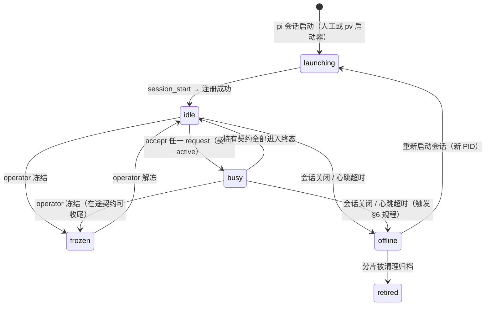

# 05 · 注册、发现与会话生命周期

> 状态：草案 Draft v0.1 · 2026-08-29
> 上游：[04 控制关系](04-control-relations.md) ｜ 下游：[06 网络动力学](06-network-dynamics.md)

本文件定义对等体如何获得身份、如何在注册表中宣告自己、如何被他人发现，以及生命周期的每一步——包括崩溃与恢复这些不体面的时刻。

## 本章要点

- 身份（PID）绑定**会话实例**：resume 视为新实例（默认换新 PID），fork/clone 必然是新对等体、不继承契约。
- 注册表按对等体分片，各写各的文件，无全局锁；心跳续期，超时判离线。
- 发现工具只返回事实（档案、能力、状态、信誉），**选择委托对象永远是发起方 LLM 的决策**（P6）。
- spawn 生成对等体，但**生成 ≠ 权威**：权威只来自契约。

---

## 1. 注册表的内容与形态

`.piniverse/registry/` 下**每对等体一个分片文件**（`<pid>.json`），加上 `contracts/active.json`（契约存储，见 [04 §2](04-control-relations.md#2-契约记录)）。分片结构：

```json
{
  "pid": "pv-3f8a12c0",
  "name": "pv-alpha",
  "role": "peer",
  "model": "glm-5.3-flash",
  "profile": "擅长 TypeScript 后端与测试；当前熟悉本仓库 pipeline 模块。",
  "capabilities": ["backend", "testing", "code-review"],
  "topics_subscribed": [],
  "status": "busy",
  "frozen": false,
  "workspace": "C:/Users/XKZ/Documents/VSCode Projects/Piniverse",
  "contracts_in": ["t-9f3e21ab"],
  "contracts_out": ["t-2c7d5e91"],
  "reputation": { "completed": 12, "failed": 1, "resigned": 0 },
  "spend_today": { "tokens": 184000, "cost": 1.2 },
  "alive_until": "2026-08-29T14:05:30+08:00",
  "registered_at": "2026-08-29T09:12:40+08:00",
  "versions": { "pv_ext": "0.1.0", "pi": "0.x.y" }
}
```

- **status 是推导值**：`busy` ⇔ 持有任一非终态契约（入向 `contracts_in` 或出向 `contracts_out`）；`frozen` 是操作员设置的独立标志位。分片里存的是物化结果，重放日志可重建。
- **并发**：每个会话只写自己的分片——注册表无写冲突；`contracts/active.json` 是唯一共享写点，短临界区文件锁保护（[02 §3](02-architecture.md#3-进程与文件布局)）。
- **清扫**：hub（在场时）或任一会话的周期检查把 `alive_until` 已过期的分片标记 `offline`（幂等操作，谁先看到谁标记——机械执行，不违反 P6）。清理策略：offline 超过 policy 清理期（默认 7 天）的分片可被归档，信箱内容早已在审计日志中。

## 2. 身份（PID）

- **格式**：`pv-` + 8 位小写 hex，注册时随机生成、对注册表现有分片查重后生效。
- **绑定对象是会话实例**：一个 pi 会话进程从启动注册到关闭，PID 不变；一旦会话结束（无论正常关闭还是崩溃），该 PID 随之退役。理由见 §6。
- **名字**：人类可读标识，域内唯一，注册时查重、冲突则要求改名。允许通过 `set_name` 工具改名——信封只携带 PID（[03 §5](03-message-protocol.md#5-寻址与名字)），改名不影响在途消息。
- **保留名**：`pv-human` 为操作员节点专用（§7）；`pv-hub` 为 hub 的只读身份（仅用于发审计性质的 notify，不参与契约）。

## 3. 生命周期



- **注册**（`session_start`）：pv-ext 生成 PID → 写分片 → 首次注册时让 LLM 自述 profile 与能力标签（一次轻量调用，结果存分片；也接受 policy 预置的静态档案）。
- **心跳**：默认周期 30s，由 Pi 事件驱动（turn 结束、工具调用间隙）+ 定时器兜底；每次心跳续期 `alive_until = now + 90s` 并刷新 status/spend。心跳**不进信箱、不占 turn、不进 LLM 上下文**。
- **优雅退出**（`session_shutdown`）：pv-ext 对所有活跃入向契约**自动代发** `resign(reason=shutdown, progress=最后已知值, handoff_notes=最新工件清单)`——这是与"预算超限代发 result"同类别的机械卫生条款（[04 · 推荐节](04-control-relations.md)）：契约里本来就有辞任义务，退出时只是机械履行。
- **frozen 语义**：冻结 = 拒绝新 request（自动 decline(policy)）+ 危险工具被钩子拦截；**在途契约允许收尾**。更彻底的"急停"（全部契约 cancel）是 operator 的显式动作，见 [08 §6](08-safety-governance.md#6-操作员权力)。

## 4. 发现

两个工具，全部只读注册表：

| 工具 | 参数 | 返回 |
|------|------|------|
| `list_peers` | 无 | 全部在线对等体的摘要（name、capabilities、status、reputation、一句话 profile） |
| `query_peers` | `{capability?, idle_only?, topic?, text?}` | 过滤后的同一摘要列表 |

- **能力标签**：标准集（`backend` / `frontend` / `testing` / `research` / `writing` / `review` / `ops` / `data` …）+ 自由标签。profile 由会话自述，允许也鼓励写"最近做过什么"——这是对等体之间传递经验的唯一内置通道。
- **选择是发起方的决策**：工具返回事实列表，绝不排序推荐（P6）。"选谁"由发起方 LLM 结合任务、信誉与 profile 判断；指南建议它把选择理由写进 note。
- **隐私边界**：发现结果不含对方上下文/转录的任何内容；对等体之间的一切信息交换只能走消息与共享工件（[07 §6](07-context-information.md#6-隐私与最小披露)）。

## 5. Spawn 语义：生成 ≠ 权威

网络里的对等体有两个来源：

1. **操作员手工开**（Form A）：人开 N 个终端跑 `pi`，项目级 `.pi/extensions/` 自动加载 pv-ext——**推荐起步形态**，与对等哲学最一致（[11 §3](11-implementation.md#3-两种起步形态)）。
2. **会话拉起新会话**（Form B / 运行中扩容）：通过 pv 启动器或 SDK `createAgentSession` 拉起新的 pi 进程。

关键规则：**拉起者对新会话没有任何制度性权力**。新会话注册后就是一个完全陌生的对等体；拉起者想让它干活，和其他任何人一样——发 request、等 accept。Pi 的 `new_session(parentSession)` 中的父子信息只作为注册表里的**来源备注**（"由 pv-3f8a12c0 拉起"），不产生任何权限含义。这样"spawn"就从机构式层级的核心权力退化成一个普通的便利操作。

## 6. 恢复与异常

| 场景 | 规程 |
|------|------|
| **worker 崩溃**（在线突然消失） | 心跳超时 → 分片标记 offline。其 master 通过心跳/时限发现 → 契约按 `expired/failed` 处理或显式 `cancel` → 重新委托（新 worker 用旧 worker 的 handoff_notes 与工件指针续作）或自己接手。契约的 `ttl` 是兜底：即使 master 也死了，契约最终自动进入终态，不会永久悬挂（[06 §5](06-network-dynamics.md#5-故障与接管)） |
| **master 崩溃** | worker 通过心跳发现 master offline → 发 `resign(reason=blocked)` 或等待至 deadline 后自然过期；若任务本身有价值，可 `escalate` 到 pv-human 请求接盘 |
| **会话 resume**（`pi -r` / switch） | **默认分配新 PID**。身份绑定实例的理由：契约关系里含有"对方当前状态"的假设（心跳、在途工作、预算中途值），恢复的会话无法证明自己还是那个执行体；而"新对等体 + master 重新委托"复用了一切既有机制（发现、要约、handoff_notes），不引入特权通道。恢复会话的 appendEntry 簿记随会话文件带回，显示"前世持有的契约及其终态"——经验连续，身份重置 |
| **fork / clone** | 必然新对等体。pv-ext 挂 `session_before_fork`，在新实例中重置契约簿记（副本不继承任何契约）；父会话的契约不受影响 |
| **时钟偏斜** | 单机场景影响极小；日志排序以**文件内顺序**为准，`ts` 仅作展示（[03 §6](03-message-protocol.md#6-投递语义)） |
| **信箱残留** | 会话死亡后信箱文件仍在；新 PID 用新信箱，旧信箱随分片清理归档。发给死对等体的消息投递成功但不被读取——发送方应结合心跳自行决定是否转投（机械事实，无决策） |

## 7. 操作员节点

- **`pv-human` 是一个普通的注册分片**：role=`operator`，同样有心跳、信箱、能力标签（操作员可以给自己写 profile——"最终裁决者"）。它与网络的接口和对等体完全一致：收 request、回 decline、发 steer、做 review。
- **技术形态（推荐）**：操作员跑一个真实的 pi 会话加载 pv-ext（人机同构，P7），pv-hub 控制台作为便利层叠加（聚合 escalation 通知、一键冻结）。hub 不在场时，操作员会话独立完成全部治理动作。
- **权力来源**：不是身份而是 **policy 中的角色授权**——`role: operator` 解锁冻结/急停/越权豁免等工具，由钩子机械执行。把"人的特权"也放进策略文件，意味着权限体系只有一个模型（[08 §2](08-safety-governance.md#2-策略文件)）。
- **escalation 的投递**：所有 `escalate(to=pv-human)` 落入操作员信箱；urgent 级别由 hub 附加系统通知。操作员离线时消息排队，返回后补收（投递语义不变）。

## 推荐 / 备选 / 开放问题

**推荐**：分片注册表；实例绑定身份；resume 换新 PID；自动代发 resign(reason=shutdown)；`status` 为推导值。

**备选**：(a) PID 固定于会话文件（resume 后 reclaim 旧契约）——少一次重新委托的开销，但需要"身份回归"协议与超时裁决，复杂度不成比例，记为 Q1 备选；(b) 注册表用单文件+全局锁（实现更简单）——在 ≤10 对等体时足够，作为 M1 的临时实现，M2 起分片化；(c) hub 专职清扫（更及时）——与"hub 旁路"原则冲突，保持"谁看到谁标记"。

**开放问题**：resume 身份策略（Q1）；跨工作区/跨机的注册表联邦（Q6）；profile 自动刷新的频率与质量（避免档案腐烂，Q14）；操作员多角色（不同人类操作员不同权限）是否需要（当前单用户假设，Q15）。
