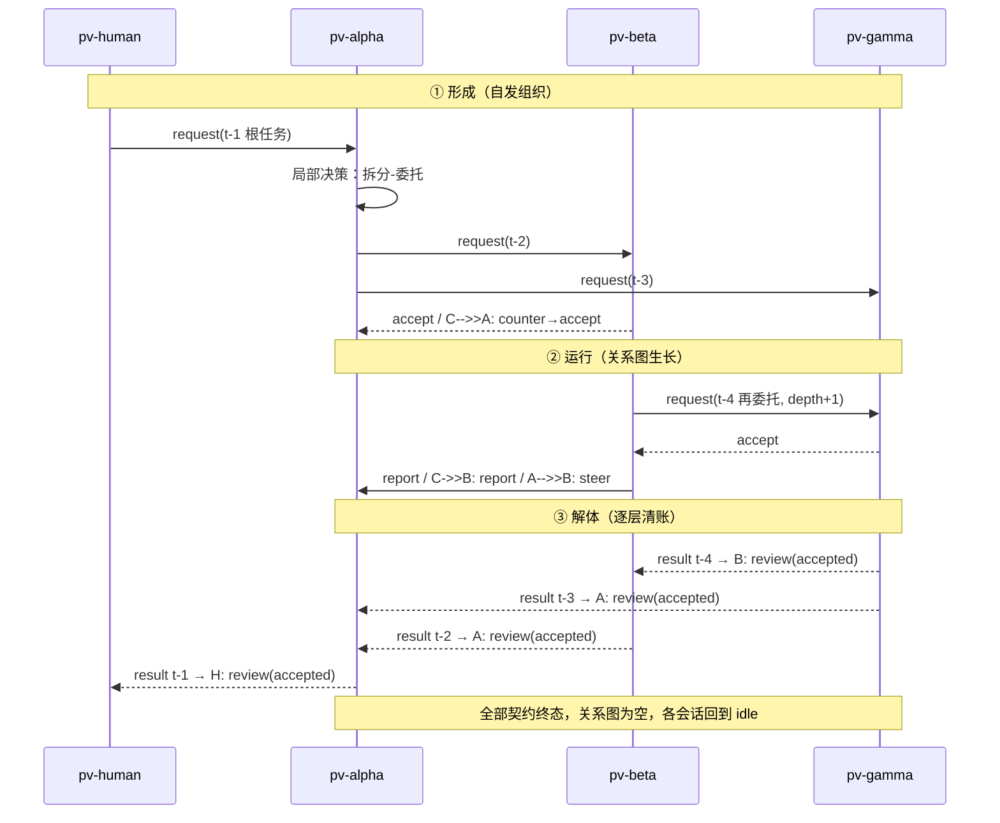

# 06 · 网络动力学

> 状态：草案 Draft v0.1 · 2026-08-29
> 上游：[04 控制关系](04-control-relations.md) · [05 注册与生命周期](05-registry-lifecycle.md) ｜ 下游：[08 安全与治理](08-safety-governance.md) · [09 场景走查](09-scenarios.md)

契约机制（[04](04-control-relations.md)）定义了网络的"语法"；本文件研究它的"动力学"——网络如何在任务中自发组织、生长、失控与解体，以及每一类失稳的对策。

## 本章要点

- 网络没有编排器：每个会话基于局部信息自主决定"自己做还是委托"。拓扑是这些决策的总和。
- 等待是事件驱动的（消息到了再继续），不是阻塞轮询——这消除了经典死锁，剩下的成环风险由 accept 时硬校验封死。
- 失控防护四件套：**深度上限、预算传播、风暴抑制、重试退避**。全部是策略 + 钩子的机械执行。
- 终止性有构造性证明：无环 + 契约必有 deadline/ttl + 预算递减 + 交付前清账 ⇒ 任何子网有界时间内解体。

---

## 1. 网络的生命：形成 → 运行 → 解体



**网络是过程，不是结构。** 没有任何"团队"在任务开始前存在；任务结束，关系图清空，对等体们回到同一片 idle 的池子里。持久留下来的只有三样东西：注册表里的档案与信誉、工作区里的工件、审计日志里的全部历史。

## 2. 决策模型：会话自己的选择

收到任务（来自 request 或来自操作员）后，会话 LLM 的第一个决策：**自己做，还是委托，还是混合**。决策输入完全局部：任务规模与自身上下文余量、`query_peers` 得到的能力与信誉、自身活跃契约的预算余量、协商的时间成本。协议指南给出启发式（写入 system prompt，非强制）：

- 预计 ≤ 10 个 turn、单文件、无并行度需求 → **自己做**（协商开销 > 收益）；
- 需要并行、需要自己不具备的专长、或会撑爆上下文 → **拆分委托**；
- **委托规格，不委托步骤**：request 写目标、交付物与验收标准，不写操作清单——微观管理会使对等网络退化成昂贵的遥控（这也是 steer 应当稀少的理由：它是应对中途变化的机制，不是日常指令通道）。

框架侧**不做任何全局规划**（P6）。MVP 甚至刻意不支持"广播招标"之类撮合机制——撮合是决策，决策属于会话。

## 3. 等待与死锁

**等待是事件驱动的**：发出 request 后，会话继续做其他事或结束 turn；accept/report/result 到达时由注入唤醒继续。协议里不存在"阻塞等待某人"的原语—— 因此经典意义的阻塞死锁（相互 join）没有立足点。

剩下的风险是**委托环导致的资源死锁**：A 委托 B、B 委托 A，双方各自"等对方的结果"实际是互相输出 token 烧预算。对策是 [04 §6](04-control-relations.md#6-网络的形成再委托权与无环规则) 的**硬规则**：accept 时注册表检查活跃契约图，成环即机械拒绝（`decline(reason=cycle)`）。保守性说明：该规则禁止 A⇄B 同时互持契约，即便某些场景下并不死锁——简单可靠优先，放宽方案见 [04](04-control-relations.md) 与本文末备选。

残余风险与兜底：

| 情形 | 兜底 |
|------|------|
| 环之外的活锁（重复 decline） | §4 的重试退避 |
| 双方都活着但互相等待语义（LLM 误用协议，在 report 里"等我"） | 指南明确"等待不是消息"；deadline/ttl 到期自然解约 |
| master 等一个已死的 worker | §5 接管规程 |
| 一切超时 | 每份契约必有 deadline 或 ttl（[03 §4.1](03-message-protocol.md#41-request)），到期机械进入终态 |

## 4. 失控防护四件套

### 4.1 深度上限（防无限递归委托）

- **软限制**（指南）：委托链建议 ≤ 3；超过 3 层通常意味着拆分粒度过细。
- **硬限制**（policy）：`max_depth`（默认 4）。request 发出时 pv-core 计算链深（[04 §2](04-control-relations.md#2-契约记录)），超限**拒发**；accept 时注册表复核，超限**拒收**。双端机械执行，LLM 无从绕过。

### 4.2 预算传播（防费用爆炸）

不变量：对任意 worker W，`W 的所有活跃子契约 budget 之和 + W 自身累计 spend ≤ W 入向契约的 budget`（W 是根任务执行者时，以 policy 的本地预算上限为准）。

- **执行点**：子契约 accept 时注册表求和校验，超了就 `decline(cost)`；worker 自身 spend 由 report/result 携带、pv-ext 累计，超限触发自动 `result(failed, reason=budget-exhausted)`（[04 · 推荐节](04-control-relations.md) 的授权论证）。
- **效果**：根任务预算是全网消耗的数学上界——无论网络长成什么样，费用不越界。这是"没有编排器也敢放权"的底气。

### 4.3 风暴抑制（防消息洪水）

- **广播限流**：`broadcast` 每对等体每分钟 2 条（policy），且默认无预置订阅——没有"全体必达"通道；
- **注入合并**：同 task 连续 report 注入时自动合并（[03 §7](03-message-protocol.md#7-与-pi-注入机制的对齐)）；
- **发送限流**：每对等体每分钟 30 条硬上限（policy），超限拒发并记审计；
- **指南约束**：report 按里程碑发，不按 turn 发；notify/query 是例外通道不是聊天频道。

### 4.4 重试退避（防撮合活锁）

request 被 decline 后：换目标重试（发现工具重新查询）；对同一目标重复委托需退避（指南：≥2 分钟）；同一任务累计 decline ≥ 3 次 → 必须升级：`escalate` 给操作员或放弃任务，禁止无脑循环撒网（指南级，超限由发送限流兜底）。

## 5. 故障与接管

| 故障 | 检测 | 接管规程 |
|------|------|---------|
| **worker 消失**（崩溃/被杀） | master 侧：心跳超时、report 断供、deadline 逼近 | 契约按终态处理（cancel 或等到 expired）→ 两条路：**重委托**（新 worker 从 handoff_notes + 工件指针续作，[03 §4.3](03-message-protocol.md)）或**吸收**（master 自己做完）。已完成部分不浪费——工件在工作区，交接单在 result/resign 的 handoff_notes |
| **master 消失** | worker 侧：心跳查询发现 master offline | 三个选项（LLM 判断）：等待（deadline 还远）；`resign(blocked)` 止损；任务有价值且无主时 `escalate` 到 pv-human 求接盘 |
| **孤儿契约**（两端都消失） | 周期清扫 + ttl | 到期机械 `expired`，工件留在工作区；操作员通过 hub 或审计日志事后发现（孤儿无自动接管者——**没有人能替死者同意新契约**，这是双边同意原则的代价，也是它的一致性） |
| **mid-task steer 时 worker 已不可控** | steer ttl=300s 过期未投递 | master 视为 worker 异常，走 worker 消失规程 |
| **整个网络冻结后遗留** | operator | 全网 `cancel`（急停，[08 §6](08-safety-governance.md#6-操作员权力)）；一切进入终态 |

## 6. 终止性论证

**命题**：任何一次任务引发的子网，在有界时间内解体（全部契约进入终态）。

**论证**（四个机械保证的合取）：

1. **无环**（accept 硬校验）：委托图是森林，没有循环供给。
2. **契约必有时限**（[03 §4.1](03-message-protocol.md#41-request)：deadline/ttl 至少其一）：每个契约自带闹钟，最坏情况到期自动终态。
3. **预算单调递减**（§4.2）：子契约预算严格小于母契约，且全网消耗 ≤ 根预算 ⇒ 子网规模有界。
4. **交付前清账**：`result(success)` 仅当 worker 名下**无活跃出向子契约**（pv-ext 机械校验，与 R1/R3 同类的合法性检查）——成果逐层向上收口，不允许"上面交付了、下面还在烧"。

四条合取 ⇒ 委托树深度有界（max_depth）、每层时间有界（deadline）、总量有界（预算）、收口有序（清账）⇒ 有限步内全部终态。∎

**诚实的边界**：终止性覆盖"一次任务"；网络整体（连续不断的新根任务）不会也不应自动停止——那是操作员的领域（freeze/halt）。另外，四条保证依赖 pv-ext 与注册表正常工作；注册表文件被手动破坏时，重放审计日志可重建（[04 §5](04-control-relations.md#5-关系即协议状态由消息推导)），审计日志被破坏属于信任模型之外的攻击（[08 §8](08-safety-governance.md#8-诚实的局限)）。

## 7. 网络形态示例

四类典型拓扑，全部由局部决策涌现，无任何全局编排：

```mermaid
flowchart LR
    subgraph 星型（并行分发）
        h1[pv-human] -->|t-1| a1[pv-alpha]
        a1 -->|t-2| b1[beta]
        a1 -->|t-3| c1[gamma]
        a1 -->|t-4| d1[delta]
    end
    subgraph 链式（流水线）
        a2[alpha] -->|t-5| b2[beta]
        b2 -->|t-6| c2[gamma]
    end
    subgraph 树形（递归拆解）
        a3[alpha] -->|t-7| b3[beta]
        a3 -->|t-8| c3[gamma]
        b3 -->|t-9| d3[delta]
        b3 -->|t-10| e3[epsilon]
    end
    subgraph 菱形（交叉评审）
        a4[alpha] -->|t-11| b4[beta]
        a4 -->|t-12| c4[gamma]
        b4 -->|t-13| d4[delta]
        c4 -->|t-14| d4
    end
```

菱形值得多说一句：delta 同时持有 beta 与 gamma 的契约（多 master 并行，[04 §7](04-control-relations.md#7-多主并行与冲突)），例如"实现"与"评审"两路汇聚到一个执行体——机构式层级里这需要两个子代理之间约定，对等网络里它是两个独立契约的自然并行。

## 推荐 / 备选 / 开放问题

**推荐**：事件驱动等待 + accept 时硬性拒环；四件套参数（max_depth=4、广播 2 条/分钟、发送 30 条/分钟、decline×3 升级）作为 policy 默认值；交付前清账作为机械校验。

**备选**：(a) 放宽为"允许成环 + 实时告警"——留给网络更多表达力（如两个对等体互为对方的评审），但需要运行时死锁检测，M2 后按实测需求重评（Q4 关联）；(b) 引入"竞价"式撮合（request 广播、多 worker 投标）——撮合是决策，违反 P6，且极易演变成风暴，明确否决；(c) 孤儿契约的自动遗产执行人（如最近的在线祖先接管）——违反双边同意，否决；孤儿处置权归操作员。

**开放问题**：成环规则的精细化（允许无害环形态？Q4）；多 master 的注意力仲裁是否需要协议级优先级队列（当前指南级，Q4）；深度/限流参数的自适应调整（Q13）。
