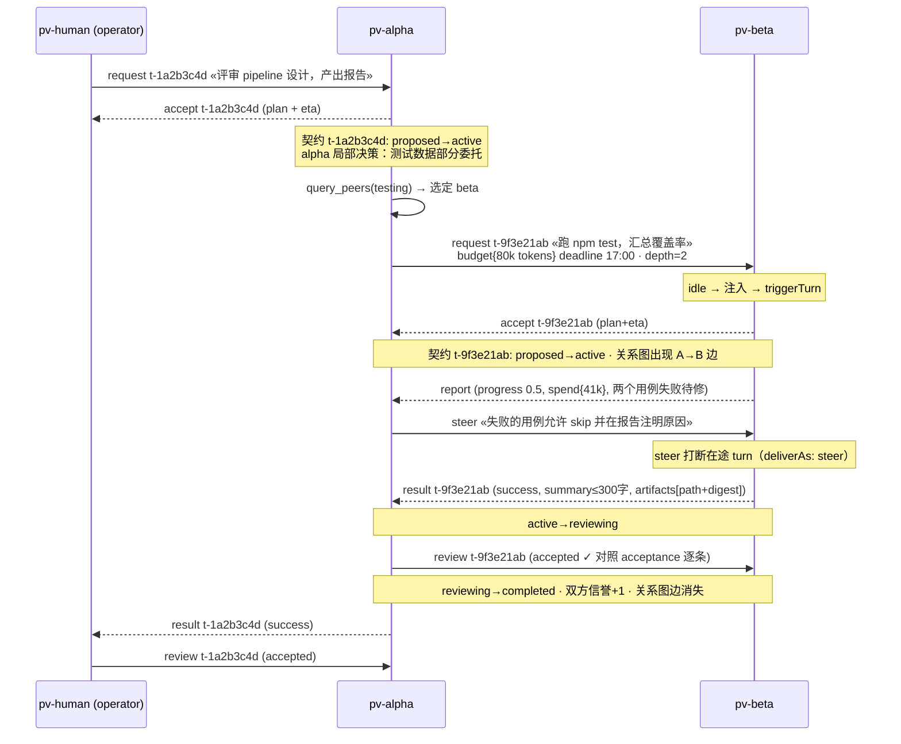
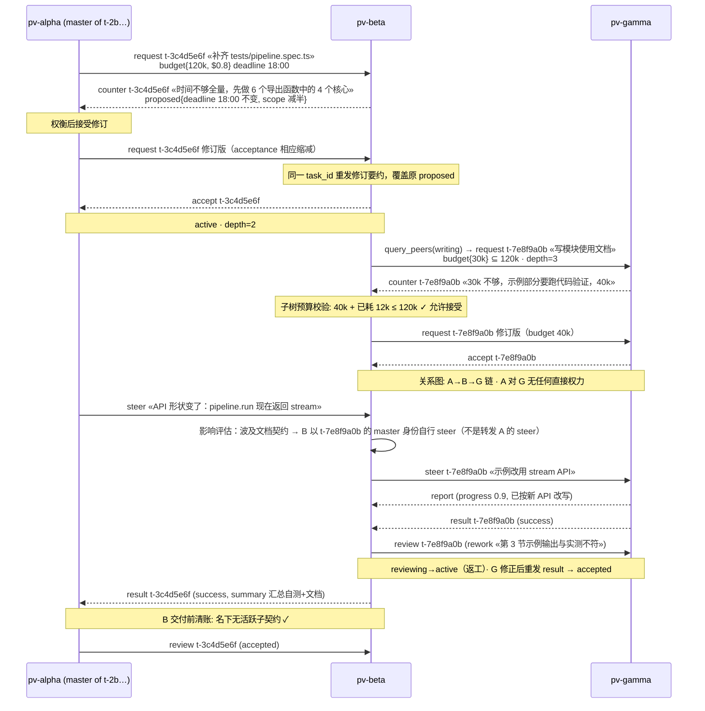
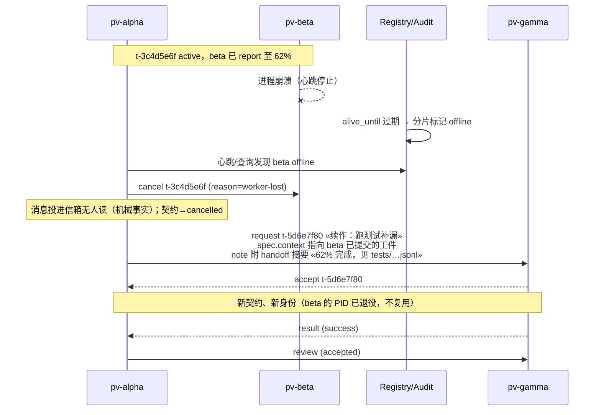

# 09 · 场景走查

> 状态：草案 Draft v0.1 · 2026-08-29
> 上游：[03 消息协议](03-message-protocol.md) · [04 控制关系](04-control-relations.md) · [06 网络动力学](06-network-dynamics.md)

三个端到端场景，把前文的机制串成可运行的剧本。所有消息类型、契约状态均与 [03](03-message-protocol.md)/[04](04-control-relations.md) 的规范一一对应；建议对照阅读。

## S1 · 最小网络：两会话协作

剧情：操作员要一份模块设计评审报告；`pv-alpha` 自己写分析，把"跑测试套件并汇总数据"委托给 `pv-beta`。

要点回顾：alpha 对 beta 的全部权力只存在于 t-9f3e21ab 之内；操作员对 t-9f3e21ab 没有直接话语权（想干预得成为它的 master 或走 escalate）。

## S2 · 多层委托、还价与中途转向

剧情：`pv-alpha` 接到"给 pipeline 模块补测试"的契约，把文档部分再委托给 `pv-gamma`；期间需求变化，master steer，gamma 还价。

要点回顾：counter 是修订要约（同 task_id 覆盖 proposed）；再委托受**子树预算校验**；steer 沿契约边逐层传递（A 不能直接 steer G）；rework 使契约回 active；**交付前清账**（[06 §6](06-network-dynamics.md#6-终止性论证)）保证 B 的 result 只在子账结清后发出。

## S3 · 故障与恢复

剧情：`pv-beta` 在执行中崩溃；`pv-alpha` 检测、善后、重委托。

两个微案例（防失控机制的实际样子）：

**案例一：成环请求被机械拒绝。** A→B 的契约 t-1 active 期间，B 向 A 发 request t-2。A 的 accept 触发注册表检查：加入 B→A 边后 A⇄B 成环 → accept 被拒绝，pv-ext 自动代发 `decline(reason=cycle)`，A 的 LLM 收到的是一条明确的机械拒绝而不是两难判断（[06 §3](06-network-dynamics.md#3-等待与死锁)）。

**案例二：预算击穿自动止损。** B 的契约 t-3 budget 80k tokens；B 的累计 spend 到 81k → pv-ext 自动代发 `result(failed, reason=budget-exhausted, handoff_notes=…)`，契约进入 failed 终态；master 重委托时以剩余预算为界（[08 §4](08-safety-governance.md#4-预算与计量)）。

## 走查结论

三个场景覆盖了协议的主要路径：协商三态（accept/decline/counter）、中途控制（steer/rework/cancel/resign）、再委托与清账、故障接管、两类机械防护。对照检查点：

- 每条箭头都是一种 [03](03-message-protocol.md) 中定义的消息类型，无协议外通道；
- 每个契约的状态变化都能在 [04 §3](04-control-relations.md#3-状态机) 跃迁表中找到行号；
- 人的每一次出现都是标准节点动作（request/review），无越权插手；
- 失控防护在剧情内被触发（预算校验、成环拒绝、心跳判离线），而不是靠角色自觉。

M1–M4 的实现验收（[11 §5](11-implementation.md#5-里程碑)）将以这三个场景的剧本作为集成测试脚本——文档即测试用例。
